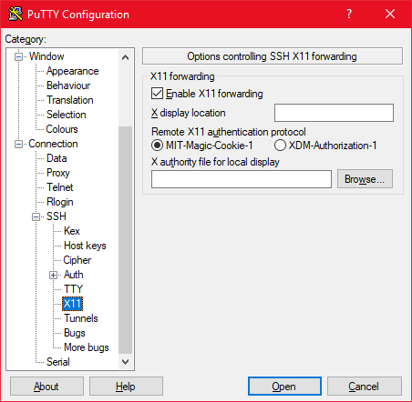
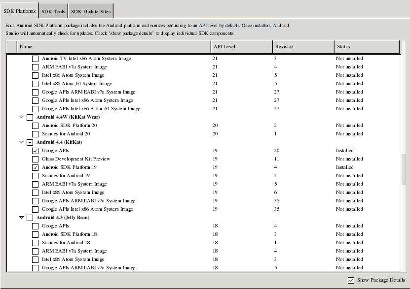
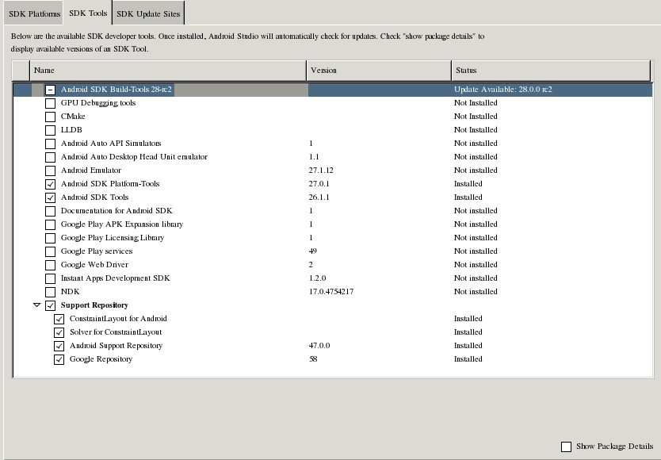

# Unity Without GUI
This document illustrates how to set up a Unity build environment on a Linux
system where no display server is running. Such system is meant to serve as a
**build server**, which builds a Unity project on request.

Unity is heavily graphical. It is not originally designed as a set of CUI tools.
It is important to know that running Unity and its external
tools(Android Studio) on a non-GUI system is a **hack**. Command line arguments
like `-batchmode` or `-nographics` are also a hack provided by Unity. They are
not fully implemented. You would see error messages from the Unity Editor's
dependency libraries(like GTK) which you wouldn't if Unity fully had implemented
the feature. When using traditional CUI build tools like GCC with a proper build
system like CMake or Autotools, you only see information regarding the build
process on the terminal. With Unity, you can't expect that. The terminal will be
filled with error messages. Despite this, the good news is that `-logFile`
output is somewhat useful. If not spammed by 3rd party assets, the information
on what went wrong can be found in the log file. But still, it's a log file, not
the build log that's supposed to be provided. It still can be spammed by other
factors like your own code or assets' code.

Through out this document, **X11 forwarding** will be used extensively. In
simple terms, X11 forwarding is a technology that makes it possible to show GUI
windows, which would normally appear on the running system, on a remote system.
"Server can't show windows? so why not show them on my PC?"

## Before Connecting to Linux System
A display server should be running on your PC.

### Windows
**Xming** is an implementation of X11 display server for Windows. **Putty** is
a SSH client. Use these programs to connect to the linux system. Prior to
connecting to the system, run Xming in the background and enable X11 Forwarding
in the Putty config.



This document will not go through explaining how to use Putty. Use the other
materials on the internet.

### Linux
If your PC is running linux, you'd probably be using it in GUI mode. If that's
the case, use the `ssh` command with `-X` option.

```
ssh -X -i <PATH_TO_KEY> builduser@the.server
```

## Preparing Linux System
X11 forwarding is a feature of SSH protocol. An SSH server that supports it
must be running on the system with the port(22) open. Most linux distros use
OpenSSH(sshd). Check if there's the line `X11Forwarding yes` in the file
`/etc/ssh/sshd_config`. This is enabled by default.

In addition to sshd, following packages are required for X11 forwarding. Install
them and reconnect the SSH sessions.

```
xauth mesa-dri-drivers xorg-x11-apps glx-utils
```

There are many tools that can help test X11 forwarding. The listing of the tools
follows. Run them one by one to test it out.

* `xeyes`
* `xclock`
* `glxgears`
* `glxinfo`

### Preparing Android Studio (Optional)
If you wish to build Android target, get Android Studio from the official site
and install it. Again, I recommend installing under `/opt`.

```
sudo mkdir /opt/android-studio
sudo chmod builduser:builduser /opt/android-studio
```

Install `java-1.8.0-openjdk-devel`. The version of JDK isn't relevant here.
By default, Android Studio will run with its own copy of JDK. You have to
override this by setting `STUDIO_JDK` environment variable.

Make file: `/etc/profile.d/android-studio.sh`.

```
alias android-studio="STUDIO_JDK=/etc/alternatives/java_sdk /opt/android-studio/bin/studio.sh"
```

After relogging in, you can run Android Studio with `android-studio` command.
Set up the Android Studio like you'd do on a GUI system.

**A little tip here**: On the SDK Manager, remove system images from SDK
Platforms and 'Android Emulator' from SDK Tools. All that's needed on
'SDK Platforms' tab is Android Platform SDK's and Google API's. The system isn't
going to run AVD, so the system images will only take up so much space.





### Preparing Unity
Latest Linux version of Unity can be found here:

* https://forum.unity.com/threads/unity-on-linux-release-notes-and-known-issues.350256/

With X11 forwarding enabled, the system will be able to run the installer with
its window shown on your PC without any hassle. Install the editor anywhere
you'd like, but I recommend installing it under `/opt/unity3d`

```
sudo mkdir /opt/unity3d
sudo chmod builduser:builduser /opt/unity3d
```

Doing this, the installer will install the editor in a subdirectory `Editor`,
and the editor binary will be at `/opt/unity3d/Editor/Unity`. Add this directory
to PATH(`~/.bash_profile` file)

After installing following packages, the editor then can be run.

```
gtk2 libsoup libarchive mesa-libGL mesa-libGLU alsa-lib \
alsa-plugins-pulseaudio alsa-tools alsa-utils GConf2 redhat-lsb-core
```

Note that you can't proceed to opening a project because the editor fails to
initialize graphics. It seems that Unity doesn't support software renderer.

#### Settings for Android Target
To build Android targets, 'external tools' settings must be set. To make changes
to the editor preferences, you have to edit the preferences file yourself.
The path to the file is `~/.local/share/unity3d/prefs`. String values are
represented in base64 in this XML file.

So, to set **AndroidSdkRoot** to `/home/builduser/Android/Sdk`, the value must
be encoded first.

```
echo -n "/home/builduser/Android/Sdk" | base64
echo -n "/etc/alternatives/java_sdk" | base64
```

Be aware that `-n` option is used so that `echo` command doesn't append a
newline character at the end of the string. If it's not used, the editor will
fail to recognise the path.

To give you an example, these are the lines that should be inserted inside the
root tag:

```
<pref name="AndroidSdkRoot" type="string">L2hvbWUvYnVpbGR1c2VyL0FuZHJvaWQvU2Rr</pref>
<pref name="JdkPath" type="string">L2V0Yy9hbHRlcm5hdGl2ZXMvamF2YV9zZGs=</pref>
```

Having done this step, if the editor still fails to produce Android targets,
test if the values are properly encoded by decoding them. Decoded values must
not include newline characters:

```
echo "L2hvbWUvYnVpbGR1c2VyL0FuZHJvaWQvU2Rr" | base64 -d
echo "L2V0Yy9hbHRlcm5hdGl2ZXMvamF2YV9zZGs=" | base64 -d
```
